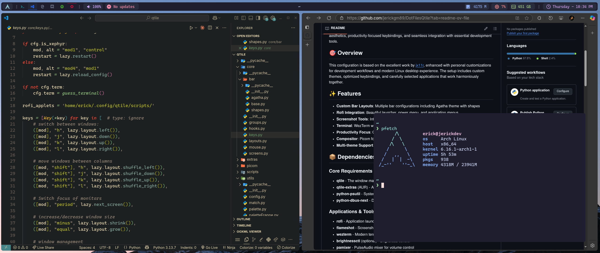

# Qtile Dotfiles Configuration



**[English](README.md)** | **[Español](README_es.md)**

A comprehensive and customized Qtile window manager configuration featuring modern aesthetics, productivity-focused keybindings, and seamless integration with essential development tools.

## 🎯 Overview

This configuration is based on the excellent work by [jx11r](https://github.com/jx11r/qtile), enhanced with personal customizations for development workflows and modern Linux desktop experience. The setup includes custom themes, optimized keybindings, and carefully selected applications that work harmoniously together.

## ✨ Features

- **Custom Bar Layouts**: Multiple bar configurations including Agatha theme with shapes
- **Rofi Integration**: Beautiful launcher, power menu, and application menus
- **Screenshot Tools**: Integrated Flameshot for quick screen captures
- **Terminal**: WezTerm with Catppuccin theme and Lua-based configuration
- **Productivity Focus**: Optimized for web development and coding workflows
- **Compositor**: Picom for smooth animations and transparency effects
- **Multi-theme Support**: Various color palettes including Catppuccin variants

## 📦 Dependencies

### Core Requirements
- **qtile** - The window manager itself
- **qtile-extras** (AUR) - Additional widgets and functionality
- **python-psutil** - System information for widgets
- **python-dbus-next** - D-Bus integration

### Applications & Tools
- **rofi** - Application launcher and menu system
- **flameshot** - Screenshot utility
- **wezterm** - Modern terminal emulator
- **brightnessctl** (optional) - Brightness control
- **pamixer** - PulseAudio mixer for volume control
- **playerctl** (optional) - Media player control
- **pacman-contrib** - Pacman utilities

### Fonts
- **otf-hasklig-nerd** - Programming font with ligatures
- **ttf-nerd-fonts-symbols-mono** - Icon fonts for the status bar
- **ttf-cascadia-code-nerd** - Cascadia Code N font with Nerd Font patches

## 🚀 Installation

1. **Clone the repository:**
   ```bash
   git clone https://github.com/jerickgm89/DotFilesQtile.git
   cd DotFilesQtile
   ```

2. **Install dependencies:**
   ```bash
   # Arch Linux / Manjaro
   sudo pacman -S qtile python-psutil python-dbus-next rofi flameshot wezterm brightnessctl pamixer playerctl pacman-contrib otf-hasklig-nerd ttf-nerd-fonts-symbols-mono
   
   # Install qtile-extras from AUR
   yay -S qtile-extras
   ```

3. **Deploy configuration:**
   ```bash
   # Backup existing configuration if present
   mv ~/.config/qtile ~/.config/qtile.backup
   
   # Copy the qtile configuration
   cp -r qtile ~/.config/
   ```

4. **Set executable permissions for scripts:**
   ```bash
   chmod +x ~/.config/qtile/scripts/*
   ```

## 🎨 Customizations

### Key Changes from Original

- **Rofi Integration**: Complete integration with [adi1090x's Rofi themes](https://github.com/adi1090x/rofi)
- **Keyboard Layout**: Optimized shortcuts for QWERTY layout (with Dvorak learning considerations)
- **Terminal Setup**: WezTerm with Rust-based performance and Lua configuration
- **Development Focus**: Enhanced for web development with Neovim integration
- **Theme Consistency**: Catppuccin color scheme throughout the desktop environment

### Terminal Configuration (WezTerm)

WezTerm was chosen for its:
- **Performance**: Written in Rust for optimal speed
- **Configuration**: Lua-based config system (ideal for Neovim users)
- **Features**: GPU acceleration, multiplexing, and extensive customization
- **Theme**: [Catppuccin theme](https://github.com/catppuccin/WezTerm) for consistent aesthetics

## 📁 Project Structure

```
qtile/
├── config.py              # Main Qtile configuration
├── core/                  # Core functionality modules
│   ├── bar/              # Status bar configurations
│   ├── groups.py         # Workspace groups
│   ├── keys.py           # Keyboard shortcuts
│   ├── layouts.py        # Window layouts
│   └── screens.py        # Screen configurations
├── scripts/              # Utility scripts
├── theme/                # Themes and styling
│   └── rofi/            # Rofi theme configurations
└── utils/                # Helper utilities and palettes
```

## ⌨️ Keybindings

### Window Management
| Key Combination | Action |
|-----------------|--------|
| `Mod + h/j/k/l` | Move focus left/down/up/right |
| `Mod + Shift + h/j/k/l` | Move window left/down/up/right |
| `Mod + -` | Shrink window |
| `Mod + =` | Grow window |
| `Mod + m` | Maximize window |
| `Mod + a` | Kill window |
| `Mod + Space` | Toggle floating |
| `Mod + c` | Center floating window |
| `Mod + s` | Bring floating windows to front |
| `Mod + Shift + Space` | Flip layout |
| `F11` | Toggle fullscreen |

### Layout & System
| Key Combination | Action |
|-----------------|--------|
| `Mod + Tab` | Next layout |
| `Mod + .` | Switch to next screen |
| `Mod + Ctrl + b` | Toggle bar visibility |
| `Mod + Ctrl + r` | Reload configuration |
| `Mod + Ctrl + s` | Shutdown Qtile |

### Applications
| Key Combination | Action |
|-----------------|--------|
| `Mod + Return` | Open terminal |
| `Mod + Shift + Return` | Open secondary terminal |
| `Mod + r` | App launcher (Type 2) |
| `Mod + Shift + r` | App launcher (Type 1) |
| `Mod + b` | Open web browser |
| `Mod + Shift + e` | Open file manager (Ranger) |
| `Print` | Screenshot tool (Flameshot) |
| `Mod + Ctrl + Escape` | Power menu |

### Media & System Controls
| Key Combination | Action |
|-----------------|--------|
| `XF86AudioMute` | Toggle audio mute |
| `XF86AudioLowerVolume` | Decrease volume |
| `XF86AudioRaiseVolume` | Increase volume |
| `XF86AudioPlay` | Play/pause media |
| `XF86AudioPrev` | Previous track |
| `XF86AudioNext` | Next track |
| `Mod + XF86AudioLowerVolume` | Decrease screen brightness |
| `Mod + XF86AudioRaiseVolume` | Increase screen brightness |

> **Note**: `Mod` key is typically the Windows/Super key

## 🔧 Configuration

The configuration is modular and easily customizable:

- **Keybindings**: Modify `core/keys.py` for custom shortcuts
- **Themes**: Adjust color palettes in `utils/palette*.py`
- **Bar Layout**: Customize status bar in `core/bar/`
- **Applications**: Update autostart in `scripts/autostart.sh`

## 🙏 Acknowledgments

- **[jx11r](https://github.com/jx11r/qtile)** - Original Qtile configuration base
- **[adi1090x](https://github.com/adi1090x/rofi)** - Beautiful Rofi themes
- **[Catppuccin](https://github.com/catppuccin)** - Consistent color palette across applications

## 📄 License

This configuration is available under the same license as the original work. See the LICENSE file for details.

---

> **Note**: This configuration is continuously evolving. Feel free to adapt it to your specific needs and workflow preferences.
